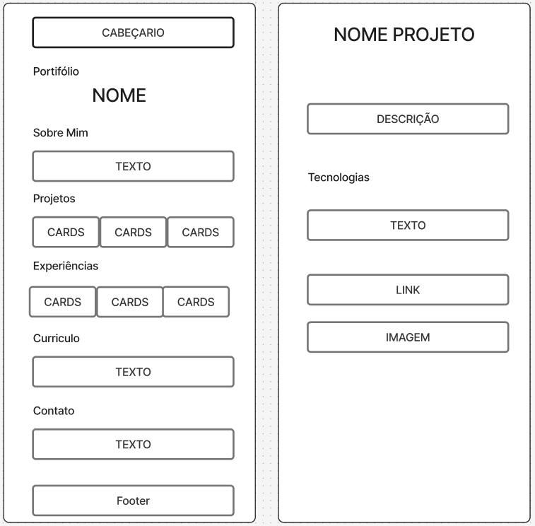

# Portifólio Profissional

Name: Miguel Honório Moreira Pena
Birth: 06/05/2006

 O projeto consiste em um website de portfólio profissional, desenvolvido para apresentar sua trajetória acadêmica e profissional, habilidades técnicas, projetos realizados e formas de contato.
 O objetivo é criar uma plataforma moderna, responsiva e acessível, que reflita sua identidade profissional e facilite a conexão com recrutadores, colegas e empresas.

 Principais seções:

 - Sobre Mim: apresentação em português e inglês, destacando formação, área de atuação e objetivos.
 - Projetos: timeline dinâmica com descrição, tecnologias, links para GitHub e imagens/GIFs.
 - Experiências: histórico de estágios, freelas e participações em projetos.
 - Contato: ícones clicáveis (e-mail, WhatsApp, LinkedIn) e formulário funcional.

## Wireframe

## Tecnologias

 - HTML
 - CSS
 - JS
 - JSON
